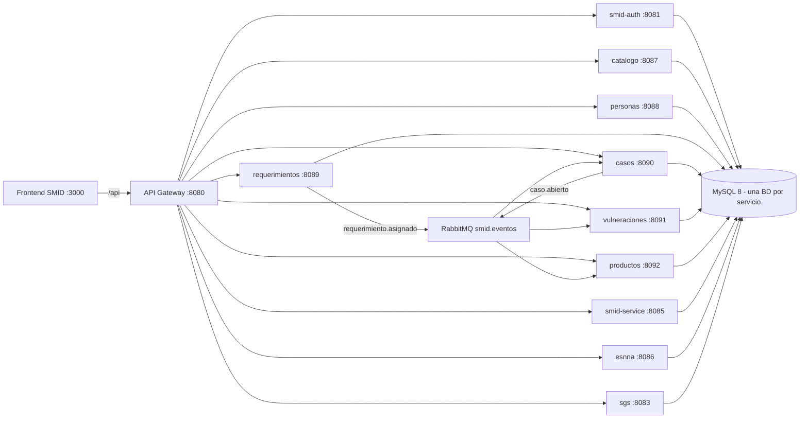

# Continuidad operativa SMID/SIGER

Ultima revision: 2026-06-26.

Este documento reduce el bus factor del ecosistema SMID/SIGER. No reemplaza los README tecnicos ni
el codigo fuente: los conecta en una guia practica para que otra persona pueda levantar, diagnosticar,
mantener y extender el sistema con criterio.

Fuentes principales:

- [`README.md`](../README.md): mapa general del monorepo.
- [`scripts/services.json`](../scripts/services.json): fuente unica de verdad del gestor.
- [`scripts/dashboard/README.md`](../scripts/dashboard/README.md): operacion del dashboard local.
- [`scripts/e2e.ps1`](../scripts/e2e.ps1): prueba end-to-end del flujo critico.
- [`docs/README.md`](README.md): corpus legado, normativo y funcional.
- READMEs de cada servicio en [`services/`](../services/).

## 1. Regla de oro

SMID/SIGER se entiende mejor como tres capas:

1. **Perimetro**: el Gateway recibe todo por `/api`, valida JWT y enruta.
2. **Nucleo**: identidad, catalogos, personas, requerimientos, casos, vulneraciones y productos.
3. **Legados integrados**: SMID Core, ESNNA y SGS viven detras del Gateway con contratos alineados,
   sin obligar a reescribirlos antes de que aporten valor.

La regla practica es simple: **nunca arreglar un servicio aislado sin revisar su contrato con el
Gateway, su `.env`, su base de datos y su posicion en `scripts/services.json`**.

## 2. Arquitectura resumida



Puntos clave:

- El Gateway y los servicios validan JWT. No se confia solo en una barrera.
- Cada servicio de negocio tiene su propia base MySQL.
- La cadena asincrona critica es `requerimiento.asignado -> caso.abierto -> FIR/productos`.
- `scripts/services.json` decide tiers, puertos, health checks, orden de arranque y `autoStart`.
- `_runtime-logs/` es evidencia de ejecucion local. No se versiona, pero sirve para incidentes.

## 3. Inventario operativo

| Servicio                 | Puerto | Ruta Gateway          | BD                  | AutoStart | Rol operativo                                                   |
| ------------------------ | -----: | --------------------- | ------------------- | --------- | --------------------------------------------------------------- |
| `smid-auth`              |   8081 | `/api/auth`           | `db_auth`           | Si        | Identidad, login, JWT y refresh token                           |
| `catalogo-service`       |   8087 | `/api/catalogo`       | `db_catalogo`       | Si        | Taxonomia de derechos y causas                                  |
| `personas-service`       |   8088 | `/api/personas`       | `db_personas`       | Si        | Registro maestro de personas                                    |
| `requerimientos-service` |   8089 | `/api/requerimientos` | `db_requerimientos` | Si        | Ingreso, envio, admisibilidad y asignacion                      |
| `casos-service`          |   8090 | `/api/casos`          | `db_casos`          | Si        | Expediente, consume `requerimiento.asignado`                    |
| `vulneraciones-service`  |   8091 | `/api/vulneraciones`  | `db_vulneraciones`  | Si        | FIR, consume `caso.abierto`                                     |
| `productos-service`      |   8092 | `/api/productos`      | `db_productos`      | Si        | Productos y tareas del caso                                     |
| `smid-service`           |   8085 | `/api/smid`           | `smid_db`           | Si        | Motor SMID legado, requerimientos/evaluaciones/oficios/reportes |
| `esnna-service`          |   8086 | `/api/esnna`          | `db_esnna`          | Si        | Motor IA ESNNA heredado                                         |
| `sgs-service`            |   8083 | `/api/sgs`            | `db_sgs`            | Si        | Gestion y seguimiento con IA                                    |
| `smid-api-gateway`       |   8080 | `/api`                | -                   | Si        | Frontera unica HTTP                                             |
| `frontend-smid`          |   3000 | proxy `/api`          | -                   | Si        | SPA Vite/React                                                  |
| `antecedentes-service`   |   8094 | `/api/antecedentes`   | `db_antecedentes`   | No        | Antecedentes y hallazgos, experimental                          |
| `instituciones-service`  |   8093 | `/api/instituciones`  | `db_instituciones`  | No        | Catalogo nacional de instituciones, experimental                |

Estado esperado con `.\scripts\siger-services.ps1 start`: todos los servicios con `AutoStart=Si`
deben quedar `UP`. `antecedentes-service` e `instituciones-service` pueden quedar detenidos salvo que
se use `-IncludeOptional` o se levanten explicitamente.

## 4. Contratos principales

Superficies HTTP observadas en codigo fuente:

| Servicio                 | Endpoints base                                                                                                          |
| ------------------------ | ----------------------------------------------------------------------------------------------------------------------- |
| `smid-auth`              | `/auth/login`, `/auth/refresh`, `/auth/logout`, `/usuarios/{altKey}`                                                    |
| `catalogo-service`       | `/catalogo/derechos`, `/catalogo/derechos/buscar`, `/catalogo/derechos/{altKey}`, administracion de derechos y causas   |
| `personas-service`       | `/personas`, `/personas/{altKey}`, `/personas/buscar-duplicados`                                                        |
| `requerimientos-service` | `/requerimientos`, `/{altKey}`, `/{altKey}/enviar`, `/{altKey}/nna`, `/{altKey}/admisibilidad`                          |
| `casos-service`          | `/casos`, `/casos/{altKey}`, `/casos/{altKey}/transiciones`                                                             |
| `vulneraciones-service`  | `/vulneraciones/fichas`, `/vulneraciones/fichas/{altKey}`, relato reservado, vulneraciones, antecedentes y transiciones |
| `productos-service`      | `/productos/productos`, `/productos/productos/{altKey}`, transiciones, `/productos/tareas`                              |
| `antecedentes-service`   | `/antecedentes/fichas`, hallazgos, referencias                                                                          |
| `instituciones-service`  | `/instituciones`, `/instituciones/tipos`, `/instituciones/puntos-focales`                                               |
| `smid-service`           | `/requerimientos`, `/evaluaciones`, `/oficios`, `/legislativo`, `/reportes` bajo `/api/smid`                            |
| `esnna-service`          | `/api/esnna/casos`, `/api/esnna/procesar`, `/api/esnna/guardar`                                                         |
| `sgs-service`            | `/api/sgs/procesar-pdf`, `/api/sgs/guardar`, `/api/sgs/procesar-respuesta`, `/api/sgs/jobs/{jobId}`, `/api/sgs/oficios` |

Nota importante: algunos legados declaran internamente `/api/esnna` o `/api/sgs`. Antes de cambiar
`StripPrefix`, rutas del Gateway o paths del frontend, probar por Gateway y directo al servicio.

## 5. Seguridad y variables

Variables que deben estar coordinadas:

- `JWT_SECRET` o `JWT_SECRET_ACTIVO`: secreto HS256 compartido. Debe coincidir byte a byte.
- `JWT_KID` o `JWT_KID_ACTIVO`: identificador de clave activa.
- `JWT_ISSUER`: normalmente `smid-auth`.
- `JWT_AUDIENCE` o `JWT_AUDIENCIA`: normalmente `smid-servicios`.
- `DB_*`: host, puerto, usuario y password de MySQL por servicio.
- `RABBITMQ_*` o `RABBIT_*`: conexion a RabbitMQ segun convencion de cada modulo.
- `OPENAI_API_KEY`: requerido por ESNNA y SGS cuando se ejecutan capacidades IA reales.
- `MINIO_*`: especialmente relevante para SGS; en desarrollo puede desactivarse si el perfil lo permite.

No versionar:

- `.env`
- dumps productivos
- respaldos con datos personales
- claves OpenAI, passwords reales de MySQL/RabbitMQ/MinIO
- logs con datos sensibles

Credencial semilla local para desarrollo:

- Usuario: `admin@defensorianinez.cl`
- Password por defecto: `Smid.Local.2026`

Esa credencial existe para desarrollo local. En ambientes reales debe ser reemplazada por gestion
formal de usuarios y secretos.

## 6. Levantar desde una maquina limpia

Requisitos:

- JDK 21.
- PowerShell 7 (`pwsh`).
- Python 3.
- Maven o wrappers `mvnw`.
- Node.js 18+ para el frontend.
- MySQL 8.
- RabbitMQ con puerto AMQP `5672` y consola `15672`.
- MinIO si se prueba SGS con almacenamiento activo.

Secuencia recomendada:

```powershell
git clone https://github.com/chashmdai/Sistema-de-Monitoreo-Integral-de-Derechos.git
cd Sistema-de-Monitoreo-Integral-de-Derechos

# Revisar prerequisitos, puertos, Java, config y coherencia JWT.
.\scripts\siger-services.ps1 doctor

# Copiar .env.example -> .env en los servicios requeridos y completar secretos locales.
# Crear bases MySQL vacias si no existen.

.\scripts\siger-services.ps1 start
.\scripts\siger-services.ps1 status
```

Bases esperadas:

```text
db_auth
db_catalogo
db_personas
db_requerimientos
db_casos
db_vulneraciones
db_productos
smid_db
db_esnna
db_sgs
db_antecedentes
db_instituciones
```

Las dos ultimas son opcionales si no se levantan los experimentales.

## 7. Operacion diaria

Comandos de rutina:

```powershell
# Diagnostico completo de prerequisitos/configuracion
.\scripts\siger-services.ps1 doctor

# Levantar stack operativo
.\scripts\siger-services.ps1 start

# Levantar incluyendo servicios opcionales
.\scripts\siger-services.ps1 start -IncludeOptional

# Ver estado
.\scripts\siger-services.ps1 status

# Reiniciar un servicio especifico
.\scripts\siger-services.ps1 restart -Services sgs-service

# Seguir logs
.\scripts\siger-services.ps1 logs -Services smid-api-gateway -Follow

# Detener todo
.\scripts\siger-services.ps1 stop
```

Dashboard:

```powershell
python .\scripts\dashboard_server.py
```

Abrir:

```text
http://127.0.0.1:8765/
```

Prueba end-to-end:

```powershell
.\scripts\e2e.ps1
```

El E2E valida login, catalogo, personas, requerimientos, eventos, casos, FIR, productos y negativos
basicos `401/404/409`. El reporte queda en `_runtime-logs/e2e/<runId>/report.json`.

## 8. Health esperado

Puertos principales:

```text
8080 gateway
8081 auth
8083 sgs
8085 smid-service
8086 esnna
8087 catalogo
8088 personas
8089 requerimientos
8090 casos
8091 vulneraciones
8092 productos
8093 instituciones opcional
8094 antecedentes opcional
3000 frontend
3306 mysql
5672 rabbitmq
15672 rabbitmq management
8765 dashboard
```

Chequeos rapidos:

```powershell
Invoke-RestMethod http://localhost:8080/actuator/health
Invoke-RestMethod http://localhost:8081/actuator/health
Invoke-RestMethod http://localhost:8083/actuator/health
Invoke-RestMethod http://localhost:8086/actuator/health
```

Si el Gateway esta `UP` pero una ruta de negocio falla, no asumir que el Gateway esta mal. Primero
verificar el servicio destino, su health, su `.env`, su base y los logs de arranque.

## 9. Troubleshooting

| Sintoma                                    | Revisión                                            | Accion probable                                                     |
| ------------------------------------------ | --------------------------------------------------- | ------------------------------------------------------------------- |
| `doctor` marca MySQL caido                 | Puerto `3306`, credenciales, base creada            | Levantar MySQL, corregir `.env`, crear BD vacia                     |
| `doctor` marca RabbitMQ caido              | Puertos `5672/15672`, usuario/password              | Levantar RabbitMQ o ajustar variables `RABBIT*`                     |
| Login `401`                                | Semilla auth, password, `JWT_SECRET`, perfil local  | Revisar `smid-auth`, `.env`, `SEED_PASSWORD`                        |
| Login OK, otros servicios `401`            | JWT distinto entre servicios                        | Igualar `JWT_SECRET`, issuer/audience y reiniciar                   |
| Gateway `UP`, ruta `/api/*` falla          | Servicio destino caido o route mal alineada         | Revisar `status`, logs y `application.yml` del Gateway              |
| Servicio no compila                        | JDK incorrecto, Maven, modulo incompleto            | Confirmar JDK 21 y distinguir servicio real de plantilla incompleta |
| Servicio arranca y cae por Flyway          | Esquema incompatible o BD con migraciones viejas    | Revisar `flyway_schema_history`, respaldar antes de tocar           |
| Caso no aparece tras asignar requerimiento | RabbitMQ, modo de eventos, listener de `casos`      | Revisar logs de `requerimientos`, RabbitMQ y `casos`                |
| FIR/productos no aparecen                  | `caso.abierto` no publicado o no consumido          | Revisar logs de `casos`, `vulneraciones`, `productos`               |
| ESNNA/SGS no arrancan                      | `OPENAI_API_KEY`, `JWT_SECRET`, DB, MinIO, RabbitMQ | Revisar `.env.example`, profile y logs del servicio                 |
| SGS falla por MinIO                        | `MINIO_ENABLED`, endpoint, access/secret, bucket    | Levantar MinIO o desactivar localmente si corresponde               |
| Frontend abre pero no consume API          | Gateway caido, proxy Vite, token vencido            | Revisar `frontends/smid`, puerto `3000`, Gateway y login            |
| Dashboard no abre                          | Puerto `8765` ocupado o proceso anterior            | `.\scripts\siger-services.ps1 dashboard-stop` y reabrir             |
| Boton "Levantar todo" parece trabado       | Espera health por nivel                             | Mirar logs de la accion en `_runtime-logs/dashboard-actions/`       |

Regla de diagnostico: **un error de runtime se investiga desde afuera hacia adentro**:

1. Infra: MySQL/RabbitMQ/MinIO.
2. `.env`: secretos y credenciales.
3. Health del servicio.
4. Logs del servicio.
5. Gateway route.
6. Frontend o cliente.

## 10. Incidentes y recuperacion

Ante un incidente:

1. No borrar bases ni `_runtime-logs` antes de capturar evidencia.
2. Guardar `.\scripts\siger-services.ps1 status`.
3. Ejecutar `.\scripts\siger-services.ps1 doctor`.
4. Capturar logs del servicio afectado.
5. Reiniciar solo el servicio afectado.
6. Si no mejora, reiniciar por nivel o todo el stack.
7. Si el incidente partio despues de un cambio, revisar `git diff` o el commit exacto.

Archivos utiles:

- `_runtime-logs/siger-services.json`: estado de procesos.
- `_runtime-logs/<timestamp>/*.log`: logs por corrida.
- `_runtime-logs/dashboard-actions/*.log`: acciones lanzadas desde dashboard.
- `_runtime-logs/e2e/<runId>/`: evidencia de pruebas E2E.

No hacer como primera respuesta:

- borrar `target/` o bases al azar sin leer el error;
- cambiar secrets en solo un servicio;
- saltarse el Gateway para "arreglar" el frontend;
- modificar migraciones Flyway ya aplicadas sin plan de reparacion;
- subir `.env` o dumps para que "otro lo mire".

## 11. Agregar o modificar un servicio

Checklist minimo:

1. Crear o actualizar el modulo en `services/<nombre>`.
2. Agregar README del servicio con puerto, BD, variables, endpoints y modo local.
3. Agregar `.env.example` sin secretos reales.
4. Definir o ajustar migraciones Flyway.
5. Registrar el servicio en [`scripts/services.json`](../scripts/services.json).
6. Definir `startLevel`, `tier`, `gatewayRoute`, `db`, `needs`, `optional` y `autoStart`.
7. Agregar ruta en el Gateway si expone API por `/api`.
8. Integrar frontend si corresponde.
9. Actualizar [`README.md`](../README.md) y este documento si cambia el mapa operativo.
10. Correr `doctor`, `start`, `status` y, cuando aplique, `.\scripts\e2e.ps1`.

Convencion practica:

- Servicio critico del stack diario: `optional=false` o `autoStart=true`.
- Servicio experimental o incompleto: `optional=true`, `autoStart=false`.
- Frontend: `kind="web"`, `path`, `command`, `url`, `port`.

## 12. Cambios antes de push

Antes de empujar a GitHub:

```powershell
git status --short
git diff --check
.\scripts\siger-services.ps1 doctor
.\scripts\siger-services.ps1 start
.\scripts\siger-services.ps1 status
.\scripts\e2e.ps1
```

Ademas:

- revisar que no existan `.env`, `target/`, `node_modules/`, `_runtime-logs/` o dumps productivos
  staged;
- revisar que los README cambien junto con el codigo cuando cambia un contrato;
- revisar que `scripts/services.json` sea coherente con puertos, rutas y autoarranque;
- si se agregan documentos a `docs/`, actualizar [`docs/README.md`](README.md).

## 13. Ruta de onboarding

Para una persona nueva, leer en este orden:

1. [`README.md`](../README.md).
2. Este documento.
3. [`docs/README.md`](README.md), especialmente la relacion entre legado, normativa y arquitectura.
4. [`scripts/services.json`](../scripts/services.json).
5. [`scripts/dashboard/README.md`](../scripts/dashboard/README.md).
6. [`scripts/e2e.ps1`](../scripts/e2e.ps1).
7. READMEs de `smid-auth`, Gateway, requerimientos, casos, vulneraciones y productos.
8. READMEs de `smid-service`, `esnna-service` y `sgs-service`.

Primeras tareas recomendadas para validar comprension:

- levantar el stack con el dashboard;
- obtener un token con el login semilla;
- correr el E2E;
- romper deliberadamente un `JWT_SECRET` local, observar el fallo, corregirlo;
- agregar un servicio dummy opcional en `services.json` y quitarlo sin tocar el resto.

## 14. Produccion y despliegue

El gestor actual es una herramienta de desarrollo local e integracion. No debe tratarse como
orquestador productivo.

Para produccion o preproduccion formal:

- secretos inyectados por gestor de secretos o variables de entorno seguras;
- perfiles `prod` activos;
- Swagger deshabilitado o protegido;
- actuator minimizado y protegido;
- TLS terminado en infraestructura controlada;
- CORS cerrado a dominios reales;
- backups probados por cada base;
- monitoreo de health, logs y latencia;
- plan de rotacion de JWT con clave activa y clave previa;
- pruebas de restauracion de MySQL antes de datos reales;
- politica clara para OpenAI, MinIO y manejo de documentos.

## 15. Conocimiento que debe quedar escrito

Cada vez que aparezca una decision, convertirla en una de estas piezas:

- README del servicio si es operacion o contrato.
- Comentario corto en codigo si evita una mala lectura local.
- Migracion Flyway si cambia esquema.
- Entrada en `scripts/services.json` si afecta arranque.
- Seccion en este documento si afecta continuidad.
- ADR futuro si es una decision arquitectonica que puede ser discutida.

Preguntas que no deben vivir solo en memoria:

- Por que existe un servicio.
- Que dato es dueño de cada servicio.
- Que evento publica o consume.
- Que rutas externas promete.
- Que variables minimas necesita.
- Como se prueba que quedo bien.

## 16. Estado actual y deuda conocida

Estado operativo actual del monorepo:

- Stack principal integrado por dashboard/CLI.
- `smid-service`, ESNNA y SGS integrados al gestor y Gateway como motores legados.
- Frontend SMID integrado al gestor como servicio `web`.
- `antecedentes-service` e `instituciones-service` documentados como opcionales/experimentales.
- Corpus documental legado y normativo conservado en `docs/`.

Deuda visible:

- ESNNA conserva `ddl-auto=update`; el resto del nucleo apunta a Flyway/validate.
- SGS depende de MinIO para flujos reales de documentos.
- Hay convenciones de variables RabbitMQ distintas entre servicios (`RABBITMQ_*` y `RABBIT_*`).
- Falta una carpeta de ADRs para decisiones arquitectonicas formales.
- El gestor local no reemplaza una estrategia productiva de despliegue.

## 17. Resumen para emergencia

Si algo falla y no hay contexto:

```powershell
cd <ruta-del-repo>
.\scripts\siger-services.ps1 doctor
.\scripts\siger-services.ps1 status
.\scripts\siger-services.ps1 logs -Services smid-api-gateway -Follow
```

Despues:

1. Revisar MySQL y RabbitMQ.
2. Revisar `.env` del servicio afectado.
3. Revisar health directo del servicio.
4. Revisar Gateway.
5. Correr `.\scripts\e2e.ps1` si el stack levanta.

El punto de control mas importante es que **el sistema no es una carpeta suelta de servicios**:
es un ecosistema con fuente unica en `scripts/services.json`, contrato externo en el Gateway,
seguridad compartida por JWT y evidencia funcional en el E2E.
